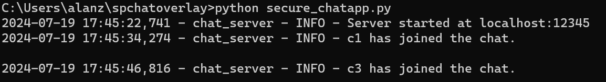
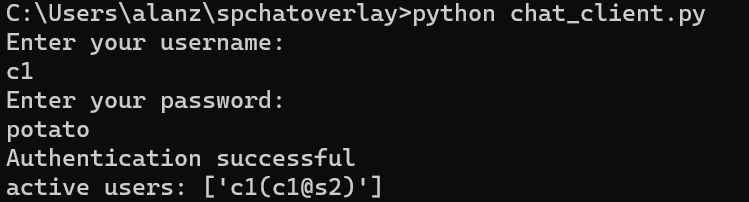
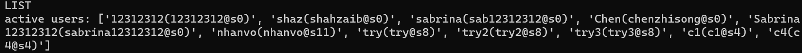
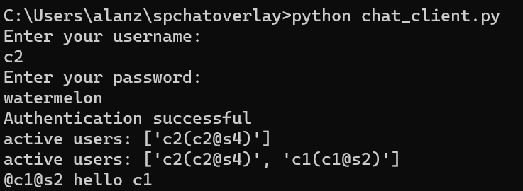
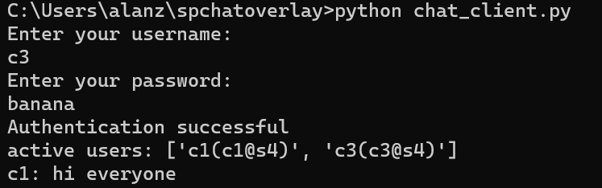
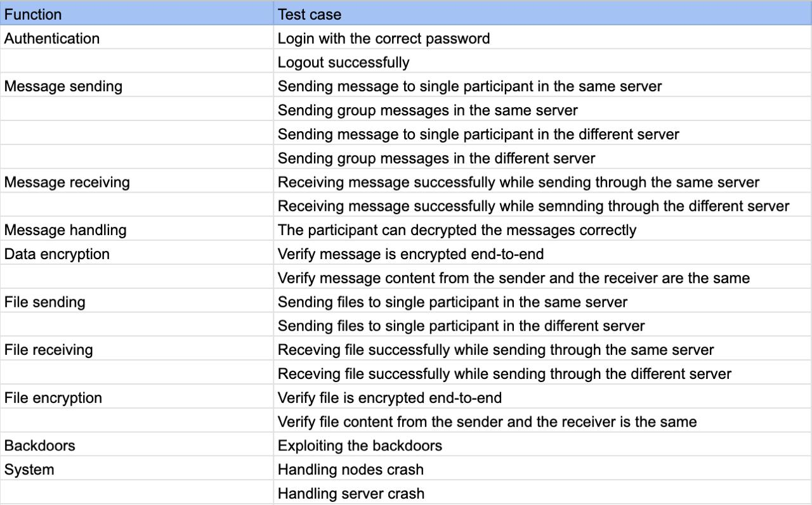

# Secure Programming Project 2024
##### Group Number: 4
##### Group Member: Anlan Zou, Czennen Trixter Tamayo, Yan Lok Chan, Yu-Ting Huang

## Description
<!-- A brief description of what the project is, what it does, and why it is useful. -->
A light weight Command Line Interface chat system based on Python and WebSocket.
Features include:
1. Private text messaging
2. Group messaging
3. File transfer
4. End-to-end encryption

## Table of Contents
- [Description](#description)
- [Installation](#installation)
- [Usage](#usage)
- [Testing and Interoperability](#testing-and-interoperability)
- 


## Installation
Step-by-step instructions on how to install and set up the project.

### Prerequisites
List any software or tools needed before installing.

### Installing
1. Step 1
2. Step 2
3. Step 3

## Usage
Enter the following command at terminal:  
1. Server and client configuration  
1.1 Set up the server configuration [server_config.yaml]  
```
server_name: s1
chat_server:
  host: <local_ip>
  port: <port_number>
exchange_server:
  host: <local_ip>
  port: <port_number>
remote_servers:
  - name: <name_of_server>
    host: <remote_server_ip>
    port: <remote_server_port>
# More remote server settings
#  - name: <name_of_server>
#    host: <ip_addr_of_remote_server>
#    port: <port_intergroup_chat>
```
1.2 Set up the client configuration [client_config.yaml]
```
chat_server
host: <chat_server_ip>
port: <chat_server_port>
```
2. Start the server
Command to start the chat server:
```
python secure_chatapp.py
```


Command to start the client:
```
python chat_client.py
```


3. At the client-side terminal, follow the instructions to log in:
```
# Example
Enter your username:
c1
Enter your password:
potato
```
If login successfully, the following message will display:
```
Authentication successful!
active users: ['c1(c1@s2)]
```


4. Check online users
Format: LIST
```
LIST
```


5. Messaging
5.1 Private Message
Format: @receipient@servername message
- 

```
# Example
@C2@S2 hello
```


5.2 Group message
Directly input the message
```
# Example:
Hi everyone
```


5. File transfer
Format: FILE receipient@servername filename
```
# Example
FILE C2@S2 readme.md
```

6. Exit the chatroom
```
EXIT
```

## Testing and Interoperability
1. Test Plan


2. Test Group Information
Group 1
?Group 3
Group 8  
Group 11  
?Group 13
